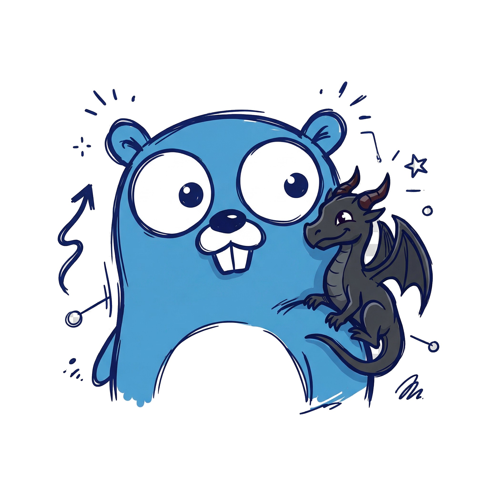
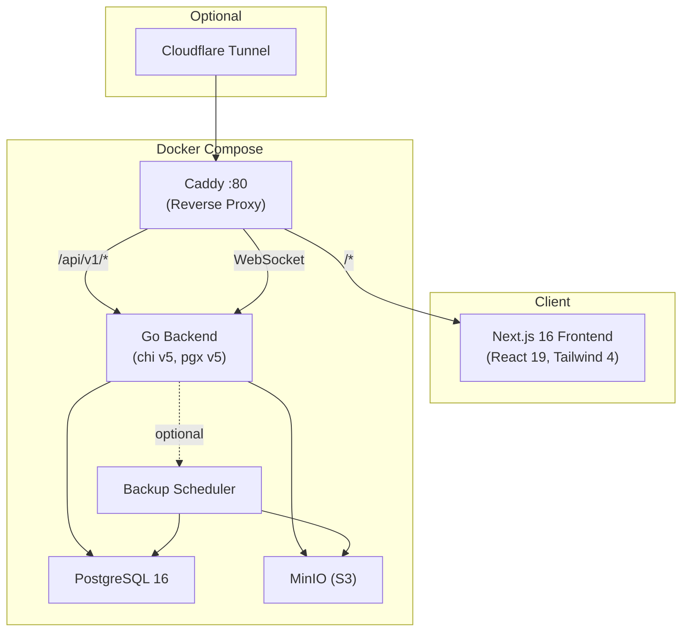

<p align="center">
  
</p>

<h1 align="center">Drawgo</h1>

<p align="center">
  A self-hosted whiteboard built with <strong>Draw</strong> (Excalidraw) + <strong>Go</strong> — hence the name.
</p>

---

> **You probably don't need this. Use [excalidraw.com](https://excalidraw.com) instead.**
>
> [Excalidraw](https://excalidraw.com) is the best whiteboard tool available — free, open-source, beautifully designed, end-to-end encrypted, and actively maintained by a world-class team. **For nearly all use cases, the official Excalidraw is the right choice.**
>
> Drawgo is **not** a replacement. It wraps the open-source Excalidraw editor inside an opinionated, self-hosted stack for a narrow set of requirements the official product intentionally doesn't cover:
>
> - **Multi-tenant workspaces** with role-based access (Owner / Admin / Member / Viewer)
> - **Persistent version history** with point-in-time restore
> - **Audit logging** for compliance (who did what, when, from where)
> - **Full data sovereignty** — PostgreSQL + MinIO, everything on your infrastructure
> - **Share links** with granular permissions and expiry
> - **Real-time collaboration** with WebSocket cursors and presence
> - **Automated backups** with Grandfather-Father-Son retention
> - **Markdown & rich text cards** on the canvas (Mermaid diagrams, Tiptap WYSIWYG)
>
> If you don't need these specific features, **use [excalidraw.com](https://excalidraw.com)** — it's simpler, faster, more polished, and requires zero infrastructure.
>
> **Huge respect to the Excalidraw team** for building and open-sourcing such an extraordinary tool. Drawgo exists only because of their work.

---

## Architecture



| Service       | Technology                                        | Purpose                                 |
| ------------- | ------------------------------------------------- | --------------------------------------- |
| **Caddy**     | Caddy 2 (Alpine)                                  | Reverse proxy, single entry point       |
| **Frontend**  | Next.js 16, React 19, TypeScript 6, Tailwind 4   | UI, Excalidraw editor, pages            |
| **Backend**   | Go 1.25, chi v5, pgx v5, zerolog, golang-jwt v5  | REST API, WebSocket, business logic     |
| **Database**  | PostgreSQL 16                                     | Relational data, full-text search       |
| **Storage**   | MinIO (S3-compatible)                             | Images, file assets, backups            |
| **Tunnel**    | Cloudflare Tunnel (optional)                      | Secure remote access without port setup |

---

## Features

### Drawing & Canvas
- Full Excalidraw Editor — all drawing tools, shapes, text, arrows, freehand
- Image Support — upload images to S3 (SHA256 dedup, MIME validation)
- Full-Text Search — find boards by title, description, or content
- Smart Autosave — ETag-based optimistic concurrency, saves only on changes

### Collaboration
- Share Links — create viewer/editor links with optional expiry
- Live Cursors — smooth 30fps cursor positions via WebSocket with native Excalidraw rendering
- Presence Indicators — see who's viewing a board in real time
- Join/Leave Events — real-time notifications when collaborators connect or disconnect

### Content Cards
- Markdown Cards — rich documentation on canvas with Mermaid diagram support
- Rich Text Cards — Notion-style WYSIWYG editing powered by Tiptap
- Resizable & Movable — cards behave like native Excalidraw elements

### Organization
- Multi-Tenant Workspaces — create and switch between organizations
- RBAC — Owner / Admin / Member / Viewer role hierarchy
- Version History — browse and restore any previous board version
- Storage Analytics — per-board and per-org storage breakdowns

### Security
- JWT Auth — HttpOnly cookies with access/refresh token rotation
- OAuth — Google and GitHub (when configured)
- CSRF Protection — Origin/Referer validation on state-changing requests
- Rate Limiting — per-IP tiers for general, auth, upload, and WebSocket
- Per-Client WS Rate Limiting — sliding-window rate limiter drops excessive messages
- Brute-Force Protection — IP lockout after failed login attempts
- Audit Logging — every action logged with actor, IP, user agent

### Operations
- Docker Compose — one command to run the entire stack
- Automated Backups — pg_dump to S3 with GFS retention policy
- Health Checks — `/api/v1/health`, `/api/v1/ready`, `/api/v1/version`
- Admin Dashboard — system stats, CRUD breakdown, backup status, log viewer, Go runtime, pgxpool, container metrics, request metrics, brute force monitor, WebSocket hub
- Cloudflare Tunnel — optional zero-config remote access
- Frontend Observability — structured client-side logging with log levels, API tracking, and error capture

---

## Quick Start

```bash
# Clone and configure
git clone https://github.com/darwinbatres/drawgo.git
cd drawgo
cp .env.example .env

# Generate secrets (REQUIRED)
sed -i "s/CHANGE_ME_RUN_openssl_rand_hex_32/$(openssl rand -hex 32)/" .env
sed -i "s/CHANGE_ME_USE_STRONG_PASSWORD/$(openssl rand -base64 32 | tr -d '\n')/" .env

# Start everything
docker compose up -d --build

# Open http://localhost:3021
```

### What's Running

| Service      | Port  | Description                  |
| ------------ | ----- | ---------------------------- |
| **Caddy**    | 3021  | Reverse proxy (entry point)  |
| **Backend**  | 8090  | Go API + WebSocket (debug)   |
| **Postgres** | 5433  | PostgreSQL 16 (localhost)    |
| **MinIO**    | 9010  | S3 API (localhost)           |
| **MinIO UI** | 9011  | MinIO console (localhost)    |

All ports are configurable via `.env`. See [docs/DEPLOYMENT.md](docs/DEPLOYMENT.md) for production setup.

---

## Development Setup

### Prerequisites

- **Go 1.25+** — Backend
- **Node.js 22+** / **pnpm 10+** — Frontend
- **Docker & Docker Compose** — PostgreSQL + MinIO

### Backend (Go)

```bash
cd backend

# Start infrastructure
docker compose up -d postgres minio

# Run with live reload (install air: go install github.com/air-verse/air@latest)
air
# Or run directly
go run ./cmd/server

# Run tests (requires Docker for testcontainers)
go test ./... -count=1
```

See [backend/README.md](backend/README.md) for Go-specific details.

### Frontend (Next.js)

```bash
# Install dependencies
pnpm install

# Start dev server
pnpm dev

# Open http://localhost:3000 (dev) or http://localhost:3021 (via Docker/Caddy)
```

### Available Scripts

```bash
pnpm dev              # Start Next.js dev server (Turbopack)
pnpm build            # Production build
pnpm start            # Start production server
pnpm lint             # Run ESLint
pnpm typecheck        # TypeScript strict type check
pnpm docker:build     # Build all Docker images
pnpm docker:up        # Start Docker Compose stack
pnpm docker:down      # Stop Docker Compose stack
pnpm docker:logs      # Follow frontend container logs
```

---

## Documentation

| Document                                       | Description                                    |
| ---------------------------------------------- | ---------------------------------------------- |
| [docs/API.md](docs/API.md)                     | Full REST API reference with request/response examples |
| [docs/ARCHITECTURE.md](docs/ARCHITECTURE.md)   | System design, ER diagram, data flows          |
| [docs/DEPLOYMENT.md](docs/DEPLOYMENT.md)       | Docker, production, Cloudflare Tunnel, backups |
| [backend/README.md](backend/README.md)         | Go backend setup, testing, project structure   |
| [CONTRIBUTING.md](CONTRIBUTING.md)             | Development workflow, code style, PR process   |
| [SECURITY.md](SECURITY.md)                     | Security policy, vulnerability reporting       |

---

## Configuration

**All configuration lives in `.env.example`.** Copy it to `.env` and customize:

```bash
cp .env.example .env
```

The file is fully documented with sections for every service (ports, database, JWT, OAuth, S3, CORS, logging, WebSocket, rate limiting, brute-force, body limits, backups, frontend, resource limits, Cloudflare Tunnel).

### Key Variables

| Variable              | Required | Default            | Description                       |
| --------------------- | -------- | ------------------ | --------------------------------- |
| `JWT_SECRET`          | **Yes**  | —                  | JWT signing key (min 32 chars)    |
| `POSTGRES_PASSWORD`   | **Yes**  | —                  | Database password                 |
| `S3_ACCESS_KEY`       | No       | `minioadmin`       | MinIO access key                  |
| `S3_SECRET_KEY`       | No       | `minioadmin`       | MinIO secret key                  |
| `CORS_ALLOWED_ORIGINS`| No       | `localhost:3021`   | Allowed CORS origins              |
| `NEXT_PUBLIC_APP_URL` | No       | `localhost:3021`   | Public frontend URL               |

---

## Production Checklist

- [ ] `JWT_SECRET` generated with `openssl rand -hex 32`
- [ ] `POSTGRES_PASSWORD` is strong and unique
- [ ] `S3_ACCESS_KEY` / `S3_SECRET_KEY` changed from defaults
- [ ] `CORS_ALLOWED_ORIGINS` matches your public domain
- [ ] `NEXT_PUBLIC_APP_URL` matches your public domain
- [ ] HTTPS enabled via Caddy or Cloudflare Tunnel
- [ ] Database port (`5433`) not exposed externally
- [ ] MinIO ports (`9010`, `9011`) not exposed externally
- [ ] `DEMO_USER_*` variables removed (not just commented)

---

## Known Limitations

- No team invitation UI (POST `/api/v1/orgs/:id/members` works via API)
- No role management UI (PATCH `/api/v1/orgs/:id/members` works via API)
- No board-level permissions UI (schema exists, not enforced)
- WebSocket horizontal scaling requires sticky sessions (single-instance only)

---

## Tech Stack

| Layer      | Technology     | Version | Notes                             |
| ---------- | -------------- | ------- | --------------------------------- |
| Framework  | Next.js        | 16.x    | Pages Router, standalone output   |
| UI         | React          | 19.x    | Concurrent features enabled       |
| Styling    | Tailwind CSS   | 4.x     | PostCSS plugin                    |
| Toasts     | Sonner         | 2.x     | Non-blocking notifications        |
| Backend    | Go             | 1.25    | chi v5, pgx v5, zerolog           |
| Database   | PostgreSQL     | 16      | Alpine image in Docker            |
| Auth       | golang-jwt v5  | —       | HttpOnly cookies, refresh rotation |
| Validation | go-playground  | v10     | All API endpoints (struct tags)   |
| Proxy      | Caddy          | 2.x     | Reverse proxy, WebSocket routing  |
| Whiteboard | Excalidraw     | 0.18.x  | Full editor embedded              |
| Rich Text  | Tiptap         | 3.21.x  | Notion-style card editor          |
| Markdown   | react-markdown | 10.1.x  | With remark-gfm                   |
| Diagrams   | Mermaid.js     | 11.13.x | Flowcharts, sequence, class, etc. |
| Thumbnails | html2canvas    | 1.4.x   | Board preview generation          |
| Runtime    | Node.js        | 22 LTS  | Alpine in Docker                  |

---

## Troubleshooting

### Container won't start

```bash
docker compose logs backend
docker compose logs frontend
docker compose logs caddy
# Common: JWT_SECRET not set, DB not ready, port in use
```

### Database connection failed

```bash
docker compose ps postgres  # Check if running
docker compose logs postgres  # Check for errors
```

### "Invalid credentials"

- Register a new account at the login page
- Or set `DEMO_USER_*` env vars in `.env` for a seeded demo user
- Check startup logs: `docker compose logs backend | grep -i user`

### Build fails

```bash
docker compose down
docker system prune -f
docker compose build --no-cache
docker compose up -d
```

---

## License

MIT

---

## Acknowledgments

- **[Excalidraw](https://excalidraw.com)** — The amazing whiteboard that powers this project. If you don't need self-hosting, use them directly.
- **[Mermaid.js](https://mermaid.js.org)** — Diagram rendering in markdown cards
- **[Tiptap](https://tiptap.dev)** — Rich text editing for Notion-style cards
- **[Next.js](https://nextjs.org)** — React framework for the frontend
- **[chi](https://github.com/go-chi/chi)** — Lightweight Go HTTP router
- **[pgx](https://github.com/jackc/pgx)** — PostgreSQL driver for Go
- **[MinIO](https://min.io)** — S3-compatible object storage
- **[Caddy](https://caddyserver.com)** — Reverse proxy with automatic HTTPS
