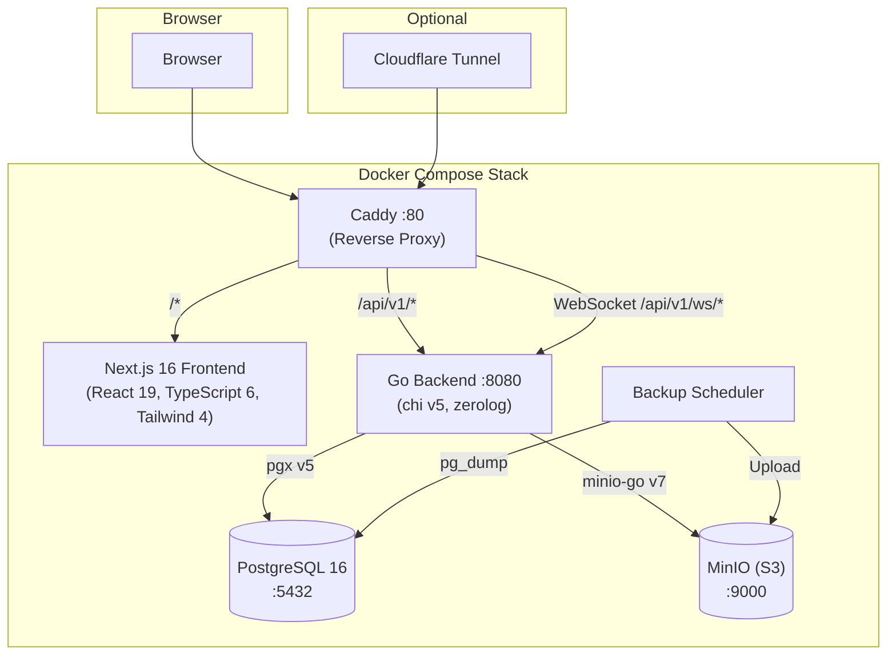
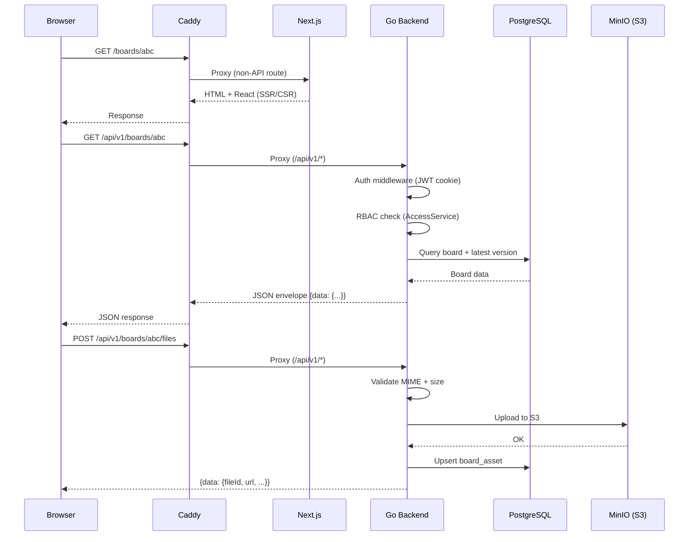
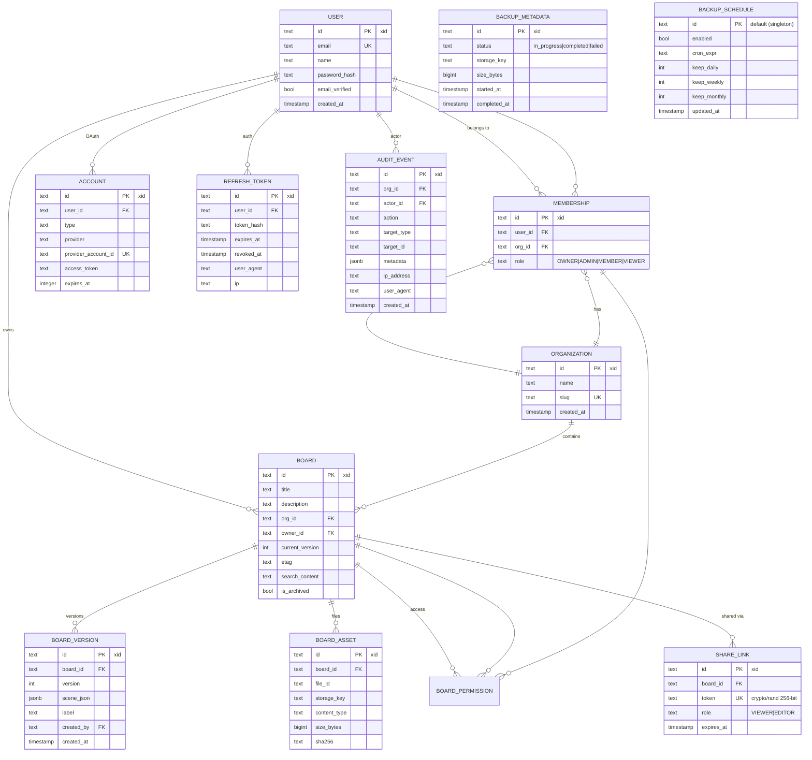
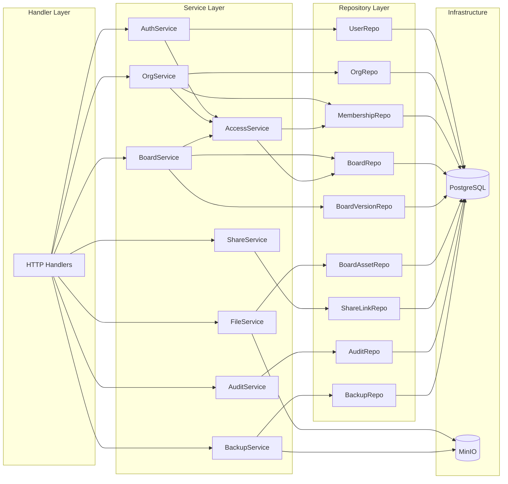
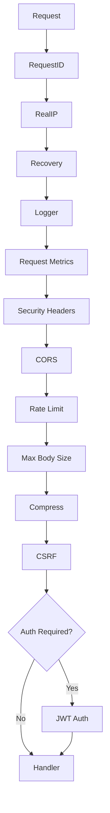
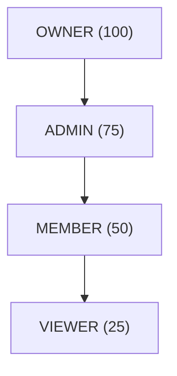
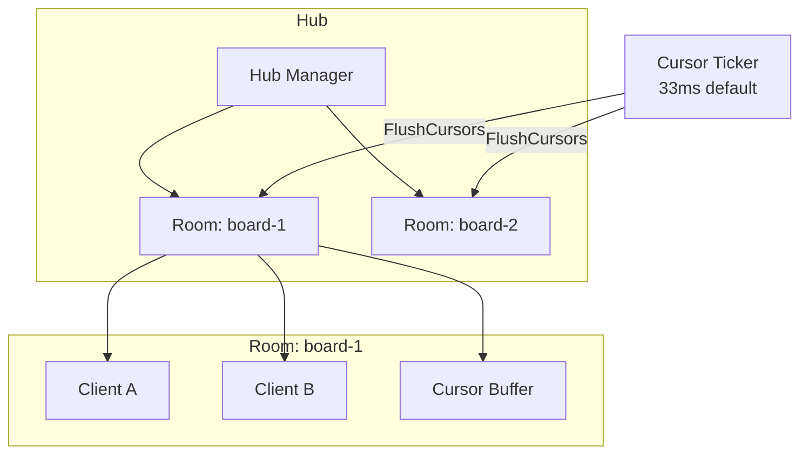
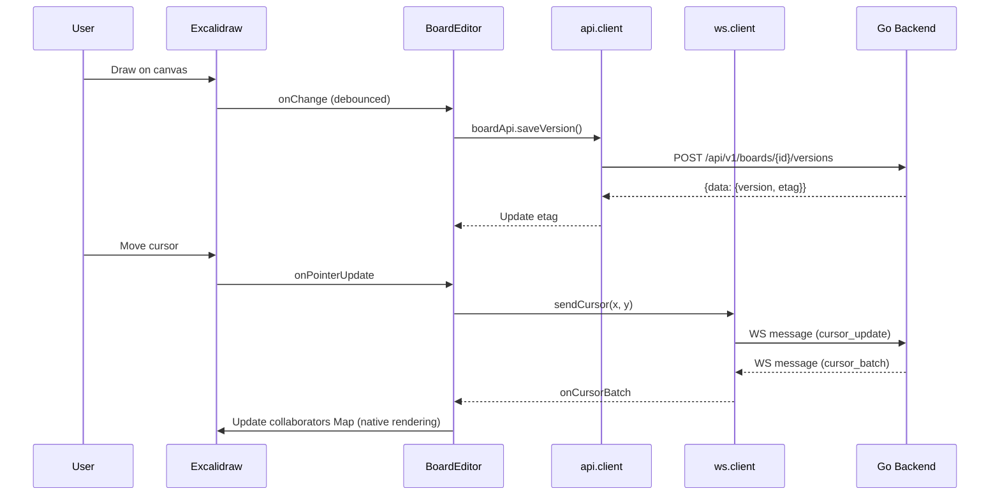

# Drawgo — Architecture

## System Overview



## Request Flow



## Data Model



## Backend Architecture



### Layers

| Layer        | Responsibility                              | Key Pattern                     |
| ------------ | ------------------------------------------- | ------------------------------- |
| **Handler**  | HTTP request/response, validation           | Decode → Service → Respond      |
| **Service**  | Business logic, authorization               | Accept interfaces, return structs |
| **Repository** | Database queries, transactions            | Parameterized SQL via pgx       |
| **Storage**  | S3 operations                               | Interface-based abstraction     |

### Middleware Stack



## RBAC Model



| Role     | Level | Permissions |
| -------- | ----- | ----------- |
| OWNER    | 100   | All org operations, delete org, manage any member |
| ADMIN    | 75    | Invite/remove members, manage boards, view audit |
| MEMBER   | 50    | Create/edit boards, upload files |
| VIEWER   | 25    | View boards and members |

Board-level permissions can override org roles via `board_permissions` table.

## Observability

The system collects metrics at multiple layers, exposed via `GET /api/v1/stats`:

| Layer | Metrics |
|-------|---------|
| **Row Counts** | Users, organizations, boards, versions, assets, audit events, memberships, share links, accounts, refresh tokens, backups |
| **CRUD Breakdown** | Global audit events grouped by action (board.create, board.update, user.login, etc.) with per-action counts and total |
| **Backup Info** | Total backups, last backup time/size/status, schedule enabled, cron expression |
| **Log Summary** | In-memory ring buffer counts by level: debug, info, warn, error, fatal, total |
| **Database** | Size, table breakdown, connections, cache hit ratio, uptime |
| **Connection Pool** | pgxpool acquired/idle/total connections, acquire counts |
| **Go Runtime** | Goroutines, heap (alloc/sys/inuse), stack, GC pause/cycles, CPU count |
| **S3 Storage** | Per-bucket object count, total bytes, largest object |
| **Process** | PID, RSS memory, open file descriptors, uptime |
| **Build** | Version, commit SHA, build time, Go version |
| **Request Metrics** | Total requests, RPS, error rate (5xx/4xx), latency percentiles (P50/P95/P99), status code distribution, HTTP method breakdown |
| **Container** | cgroup v1/v2 memory limit/usage, CPU quota/period, effective CPUs, container detection |
| **Brute Force** | Tracked IPs, locked IPs |

Build-time variables are injected via `-ldflags` targeting `pkg/buildinfo` and are shared between the health handler (`/version`) and the stats endpoint.

The admin dashboard (`/settings`) auto-refreshes every 30 seconds when live mode is enabled and visualizes all metrics with color-coded status cards, progress bars, and distribution charts. New in the latest release: CRUD operations breakdown (grouped by domain), backup status section, and log level summary with visual bar chart.

## WebSocket Architecture



- **Hub:** Manages rooms (one per board), runs tick loops for cursor batching
- **Room:** Tracks connected clients, buffers cursor updates, broadcasts
- **Client:** Goroutine pair (readPump + writePump), 64-slot buffered send channel, per-client sliding-window rate limiter (30 msg/sec)
- **Cursor Batching:** Cursors batched at configurable intervals (default 33ms / ~30fps) to reduce network traffic; frontend renders with self-filtering
- **Auth:** JWT via HttpOnly `access_token` cookie (default), `?token=` query param, or share link via `?share=` query parameter
- **Cursor Rendering:** Uses Excalidraw's native `collaborators` prop (Map<SocketId, Collaborator>) — no custom overlay needed

## Frontend Architecture

```
src/
├── pages/                    # Next.js Pages Router
│   ├── index.tsx             # Dashboard (board list, create, search)
│   ├── boards/[id].tsx       # Board editor page
│   ├── boards/shared/[token].tsx  # Public shared board
│   ├── settings.tsx          # Admin dashboard (stats, runtime, pool, WS hub, DB health, storage, client logs)
│   ├── _app.tsx              # AuthProvider + AppProvider
│   └── _document.tsx         # HTML document
├── contexts/
│   ├── AuthContext.tsx        # JWT auth state, auto-refresh
│   └── AppContext.tsx         # Org selection, user state
├── services/
│   ├── api.client.ts         # Typed API client (fetch + envelope unwrap)
│   ├── logger.ts             # Frontend observability (log buffer, API metrics)
│   └── ws.client.ts          # WebSocket client (reconnect, keepalive)
├── components/
│   ├── ErrorBoundary.tsx     # React error boundary with fallback UI
│   ├── excalidraw/           # Editor components
│   │   ├── BoardEditor.tsx   # Main editor + autosave + file upload + collaboration
│   │   ├── LiveCursors.tsx   # Remote cursor overlay (60fps interpolation)
│   │   ├── PresenceBar.tsx   # Active viewers indicator
│   │   ├── MarkdownCard.tsx  # Markdown renderer (+ Mermaid + search highlighting)
│   │   ├── MarkdownCardEditor.tsx  # Markdown edit/preview modal
│   │   ├── RichTextCard.tsx  # Tiptap rich text renderer
│   │   ├── RichTextCardEditor.tsx  # Notion-style WYSIWYG editor (toolbar, tables, links)
│   │   ├── MermaidRenderer.tsx     # Mermaid diagram rendering with DOMPurify
│   │   ├── SaveIndicator.tsx # Save status (6 states: idle/saving/saved/error/conflict/offline)
│   │   └── VersionHistory.tsx
│   ├── dashboard/            # Admin dashboard sections (17 components)
│   │   ├── OverviewSection.tsx
│   │   ├── BuildInfoSection.tsx
│   │   ├── ProcessSection.tsx
│   │   ├── S3StorageSection.tsx
│   │   ├── RuntimeSection.tsx
│   │   ├── PoolSection.tsx
│   │   ├── DatabaseHealthSection.tsx
│   │   ├── TableStorageSection.tsx
│   │   ├── WebSocketSection.tsx
│   │   ├── ContainerSection.tsx
│   │   ├── BruteForceSection.tsx
│   │   ├── RequestMetricsSection.tsx
│   │   ├── BackendLogsSection.tsx
│   │   ├── ClientLogsSection.tsx
│   │   ├── CRUDBreakdownSection.tsx
│   │   ├── BackupInfoSection.tsx
│   │   └── LogSummarySection.tsx
│   ├── ui/                   # Reusable UI primitives (14 components)
│   │   ├── Button.tsx
│   │   ├── ConfirmDialog.tsx
│   │   ├── EmptyState.tsx
│   │   ├── ErrorAlert.tsx
│   │   ├── Icons.tsx
│   │   ├── Input.tsx
│   │   ├── LogTable.tsx
│   │   ├── Modal.tsx
│   │   ├── Pagination.tsx
│   │   ├── ProgressBar.tsx
│   │   ├── SectionHeader.tsx
│   │   ├── ShareDialog.tsx
│   │   ├── Spinner.tsx
│   │   └── StatCard.tsx
│   └── layout/
│       ├── Header.tsx        # Top nav with org dropdown, user menu, workspace management
│       └── Layout.tsx        # App wrapper with Header + container
├── types/index.ts            # Shared TypeScript types (500+ lines)
├── lib/
│   ├── constants.ts          # Size limits, config, validation helpers
│   ├── hooks.ts              # Custom hooks (useAsyncAction, useModal, useOutsideClick)
│   └── utils.ts              # ID generation, debouncing, formatting
└── styles/globals.css        # Tailwind 4
```

### Data Flow


